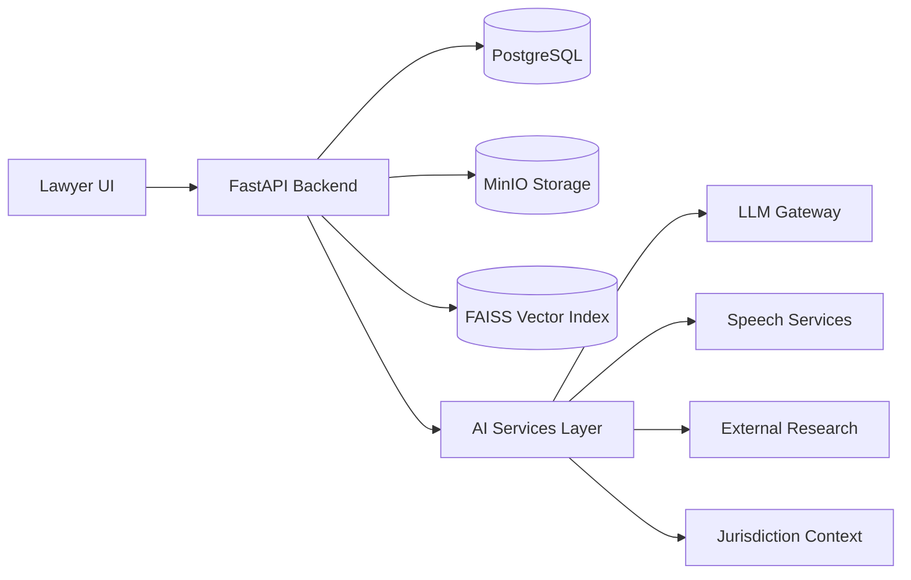
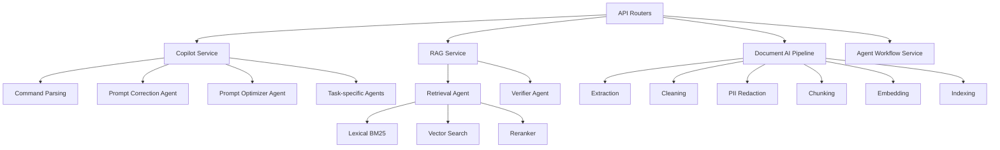
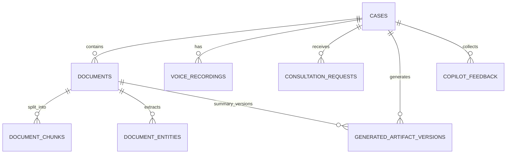

# Legal AI Platform
## Technical and Product Report for Jury Evaluation

Version: 1.0  
Date: March 30, 2026  
Project: Legal AI Platform  
Scope: Backend-first legal intelligence platform with multi-agent orchestration, case-grounded retrieval, and production-ready copilot workflows

---

## Executive Summary

This report presents the complete technical architecture, AI design, data lifecycle, quality controls, and measurable outcomes of the Legal AI Platform. The platform was engineered to support legal professionals in real case workflows, not generic chatbot usage. It combines case management, document intelligence, transcription intake, retrieval-augmented generation (RAG), external legal research, jurisdiction-aware reasoning (Tunisia and Germany), and versioned drafting workflows.

The central engineering objective was to produce answers that are:

- Grounded in uploaded evidence
- Operationally useful to lawyers
- Stable under follow-up prompts and conversational context
- Auditable through source traces, deterministic fallbacks, and evaluation gates

The final system includes a dedicated multi-agent layer with specialized responsibilities:

- Prompt correction
- Prompt optimization
- Retrieval and reranking
- Case reasoning
- Timeline building
- Booking and intake interpretation
- Document comparison
- Drafting
- Verification
- Document summarization
- Workflow orchestration

The platform does not currently rely on custom fine-tuning of model weights. Instead, it uses a production-oriented adaptation strategy:

- Strong domain heuristics
- Prompt contracts with strict output schemas
- Jurisdiction guardrails
- Retrieval and rerank quality controls
- Regression eval suites and smoke tests

Measured quality outcomes are strong in the current benchmarked scope:

- Automated eval suite: 43/43 passed (100.0%)  
  Source: `advancement/evals/agent_eval_report_20260330_152325.json`
- Focused summary eval subset: 6/6 passed (100.0%)  
  Source: `advancement/evals/agent_eval_report_20260330_152359.json`
- End-to-end smoke flow supported and scripted  
  Source: `scripts/full_smoke_test.py`

This report documents all major technical layers in depth, with special focus on AI agents, data preparation readiness, and before/after system hardening results.

---

## 1. Project Context and Objectives

### 1.1 Problem Context

Law firms require fast and reliable support for high-volume, high-stakes legal work:

- Parsing and summarizing long legal documents
- Tracking deadlines and risk indicators
- Building case timelines across multiple evidence sources
- Drafting client communication in a consistent legal tone
- Handling voice intake and converting it into structured legal context
- Working across multiple jurisdictions where legal assumptions differ

Traditional legal workflows are fragmented across manual files, ad hoc notes, and inconsistent communication. Generic AI chat interfaces are often not enough because they lack:

- Case-scoped retrieval controls
- Structured legal output contracts
- Jurisdiction awareness
- Auditability and source grounding
- Versioned human-in-the-loop edits

### 1.2 Product Vision

The platform is designed as a case-centric legal intelligence workspace where each AI answer is anchored to legal data in context. The objective is to reduce lawyer cognitive load while preserving legal rigor and traceability.

### 1.3 Core Engineering Objectives

1. Build a robust legal data pipeline from raw files to indexed evidence.
2. Design an agent architecture where each agent has a narrow, testable role.
3. Enforce predictable response formats for key legal tasks.
4. Improve conversational intent handling and follow-up memory.
5. Add jurisdiction guardrails (Tunisia and Germany).
6. Add external research integration without breaking grounded internal reasoning.
7. Implement measurable quality gates (eval suite + regression checks + smoke flow).
8. Enable human editing with persistent version history for critical outputs.

---

## 2. System Architecture Overview

### 2.1 High-Level Architecture

The platform follows a backend-first architecture:

- Frontend React application as legal copilot command surface
- FastAPI backend as orchestration and policy layer
- AI service modules for ingestion, retrieval, and reasoning
- PostgreSQL for transactional data
- FAISS + metadata store for vector retrieval
- MinIO for file storage
- Optional Redis and SMTP integrations

### 2.2 Backend Module Topology

### 2.3 Multi-Tenant and Scope Controls

All relevant retrieval and workflow queries are tenant-scoped and support case/document scoping:

- Tenant-level separation on database and search filters
- Case-level and document-level query restrictions
- Scoped output metadata including `case_id`, `document_id`, `filename`, and chunk references

---

## 3. Data Architecture and Readiness Pipeline

### 3.1 Core Data Entities

Key entities used by the AI runtime:

- `Case`
- `Document`
- `DocumentChunk`
- `DocumentEntity`
- `VoiceRecording`
- `ConsultationRequest`
- `GeneratedArtifactVersion`
- `CopilotFeedback`

Notable schema features:

- Cases include `jurisdiction_country` (`tunisia` or `germany`)
- Documents store extracted text, redacted text, summary fields, and intelligence metadata
- Chunks persist retrieval-ready text slices
- Artifacts maintain selectable version history for summaries and emails
- Feedback captures thumbs up/down signals with intent metadata

### 3.2 Document Readiness Pipeline

Document processing path:

1. Download from object storage
2. Extract text (`.pdf`, `.txt`, `.md`)
3. Normalize whitespace and formatting
4. Run entity extraction
5. Redact PII while preserving safe legal references
6. Chunk with legal-structure-aware splitter
7. Generate embeddings
8. Write embeddings + metadata into vector store
9. Mark document status as processed

Operational controls:

- Explicit status transitions: `pending -> processing -> processed/failed`
- Error capture in `processing_error`
- Re-index support by removing old embeddings before add

### 3.3 Text Extraction and Cleaning

Current extraction strategy:

- PDF extraction via `pypdf`
- Plain text and markdown direct read
- Unsupported type rejection

Cleaning strategy:

- Normalize line breaks
- Collapse repeated whitespace
- Reduce blank line noise

### 3.4 PII Redaction Strategy

Redaction targets:

- Emails
- Phone numbers
- Personal identifiers

Safety mechanism:

- Legal reference allowlist protects references such as invoice IDs and clause/article references to avoid over-redaction.

### 3.5 Entity and Insight Readiness

Entity extraction:

- Uses spaCy (`en_core_web_sm`) with aggressive legal-domain filtering to remove noisy entities.
- Valid labels: `PERSON`, `ORG`, `GPE`, `LOC`, `DATE`, `MONEY`.

Insight generation:

- Heuristic classifier for document type
- Important dates extraction (absolute and relative)
- Payment and termination clause detection
- Missing evidence detection
- Legal risk and recommendation synthesis

Output is persisted in structured JSON in `insights_json`.

### 3.6 Chunking and Indexing Readiness

Chunking parameters:

- `CHUNK_SIZE` default: 1000
- `CHUNK_OVERLAP` default: 180

Chunking design choices:

- Preserve legal headings and clause boundaries when possible
- Sentence-aware fallback splitting for large paragraphs
- Word-boundary overlap to avoid partial token artifacts

Vector indexing:

- Embeddings normalized and indexed with FAISS `IndexFlatIP`
- Metadata persisted in `faiss_metadata.json`
- Atomic save logic with retry for Windows file locks

---

## 4. AI Model Stack and Provider Strategy

### 4.1 LLM Gateway

The LLM gateway is provider-agnostic and supports OpenAI-compatible endpoints, including Groq and OpenRouter-style integrations.

Capabilities:

- API key abstraction (Groq or OpenAI-compatible)
- Base URL normalization
- `responses.create` with chat-completions fallback
- Output extraction from heterogeneous response formats
- OpenRouter header support when relevant

Current model fields:

- `LLM_MODEL`
- `SUMMARY_AGENT_MODEL`
- timeout and retry controls

### 4.2 Speech Stack

Speech processing supports layered fallback:

1. Speechmatics API (if key configured)
2. Remote transcription API (if configured and valid)
3. Local ASR pipeline fallback (transformers ASR, default Whisper tiny)

Additional reliability controls:

- Polling and timeout controls for async Speechmatics jobs
- WAV conversion with ffmpeg when needed
- Helpful failure messages for torchaudio/format issues
- Startup prewarm for local ASR

### 4.3 Retrieval Models

- Embedding model: `all-MiniLM-L6-v2`
- Reranker model: `cross-encoder/ms-marco-MiniLM-L-6-v2`
- Hybrid scoring weights from config:
  - lexical weight default `0.4`
  - semantic weight default `0.6`

### 4.4 Training Status Across Models

There is no in-project gradient fine-tuning of LLM/embedding/reranker/STT model weights yet.

Current adaptation approach:

- Prompt engineering with schema contracts
- Heuristic post-processing and filtering
- Hybrid retrieval and reranking
- Iterative evaluation and regression hardening

This is appropriate for rapid product iteration and legal safety gating, while retaining a clear upgrade path to supervised fine-tuning in future phases.

---

## 5. Multi-Agent System Design

### 5.1 Agent Inventory

The platform includes the following agent classes:

1. `PromptCorrectionAgent`
2. `PromptOptimizerAgent`
3. `RetrievalAgent`
4. `VerifierAgent`
5. `SummarizationAgent`
6. `CaseReasoningAgent`
7. `TimelineAgent`
8. `BookingAgent`
9. `DocumentComparisonAgent`
10. `DraftingAgent`
11. `IntakeAgent`

Orchestration layers:

- `CopilotService` for single-turn and conversational routing
- `AgentWorkflowService` for staged compound workflows

### 5.2 Agent-by-Agent Matrix

| Agent | Primary Role | Inputs | Outputs | Training Status | Fallback Strategy |
|---|---|---|---|---|---|
| PromptCorrectionAgent | Correct user prompt semantics and typos without changing intent | Raw query + conversation history | Corrected query | No fine-tuning; heuristic + LLM correction | Heuristic correction only |
| PromptOptimizerAgent | Rewrite prompts into retrieval-friendly legal tasks | Raw query + intent + target scope | Optimized prompt | No fine-tuning; heuristic framing + optional LLM rewrite | Heuristic optimization |
| RetrievalAgent | Retrieve evidence chunks | Question + scope + top_k | Ranked chunks with method and scores | No training; hybrid lexical/semantic + rerank | Hybrid without rerank if unavailable |
| VerifierAgent | Check grounding of generated answers | Question + answer + evidence snippets | Verification decision + supported answer | No training; heuristic overlap + optional LLM verification | Heuristic verifier |
| SummarizationAgent | Generate structured legal summaries from document text | Document text + heuristic insights | Summary JSON package | No fine-tuning; prompt-constrained generation | Heuristic summary assembly in service layer |
| CaseReasoningAgent | Build case-level legal brief from document intelligence | Case + docs + intake + voice + jurisdiction | Overview, issues, dates, risks, steps | No fine-tuning; heuristics + optional LLM synthesis | Heuristic case brief |
| TimelineAgent | Build chronological timeline | Case docs + consultations | Timeline text + event list | No fine-tuning; heuristics + optional LLM polishing | Heuristic timeline |
| BookingAgent | Interpret consultation request state | Consultation rows | Booking narrative and next action | No fine-tuning; heuristic extraction + optional LLM rewrite | Heuristic booking summary |
| DocumentComparisonAgent | Compare multiple case docs and find inconsistencies | Case docs and insights | Comparison overview text | No fine-tuning; metric and insight heuristics + optional LLM synthesis | Heuristic comparison |
| DraftingAgent | Produce client-ready email drafts | Case summary + jurisdiction | Email body | No fine-tuning; prompt-constrained generation | Template draft |
| IntakeAgent | Convert transcript into structured intake payload | Transcript + optional fallback fields | Structured intake fields | No fine-tuning; transcript heuristics | Heuristic-only (by design) |

---

## 6. Deep Agent Analysis: Role, Data, Training, Results

This section details each agent in jury-facing engineering language, including role clarity, adaptation method, and observed quality progression.

### 6.1 Prompt Correction Agent

Role:

- Fix noisy user prompts before intent routing.
- Preserve semantic meaning and language while correcting frequent user typos.

Key mechanism:

- Rule dictionary for high-frequency errors (`sumarize`, `caze`, `eksternal`, etc.)
- Optional multilingual LLM pass with strict JSON return schema
- Conversation-aware context for better correction stability

Training:

- No model fine-tuning.
- Adapted through prompt contract plus curated correction heuristics.

Before hardening (observed in manual QA):

- Typos and informal phrasing sometimes caused intent drift.

After hardening:

- Better robustness to casual, multilingual, and typo-heavy prompts prior to intent parsing.

### 6.2 Prompt Optimizer Agent

Role:

- Transform user query into clearer legal instruction for downstream retrieval and answering.

Key mechanism:

- Scope injection (`For case #X...` / `For document #Y...`)
- Intent-aware optimization notes
- Optional LLM rewrite for cleaner legal framing

Training:

- No model fine-tuning.
- Prompt design + deterministic heuristic rewrite layer.

Before hardening:

- Direct user prompts could be vague and under-specified for retrieval.

After hardening:

- Higher consistency in structured tasks and cleaner legal response framing.

### 6.3 Retrieval Agent

Role:

- Evidence retrieval for legal QA and all reasoning tasks.

Key mechanism:

- BM25 lexical search + vector semantic search
- Configurable hybrid score fusion
- Cross-encoder rerank stage
- Non-legal/test artifact filtering with legal-signal override

Training:

- No fine-tuning in project.
- Uses pretrained embedding and reranker models.
- Tuned operationally through hybrid weights, score thresholds, and filtering rules.

Before hardening:

- Test or non-legal artifacts could contaminate context.

After hardening:

- Better legal relevance in chunk pool.
- Cleaner final ranking with lower prompt-template leakage.

### 6.4 Verifier Agent

Role:

- Prevent weakly grounded final answers.

Key mechanism:

- Heuristic overlap checks:
  - answer-source lexical overlap
  - top source score threshold
  - question-source term alignment
- Optional LLM verification with strict schema
- Returns `supported_answer` fallback when grounding is weak

Training:

- No fine-tuning.
- Deterministic verification heuristics + optional LLM review.

Before hardening:

- Potential acceptance of answers not tightly tied to retrieved evidence.

After hardening:

- Better guardrail behavior: unsupported answers are downgraded or fallbacked.

### 6.5 Summarization Agent

Role:

- Produce structured legal document summaries from cleaned source text and heuristic insights.

Key mechanism:

- Prompt schema enforces sections:
  - Overview
  - Main Issues
  - Key Obligations / Clauses
  - Key Dates
  - Legal Risks
  - Recommended Next Steps
- Returns JSON for safe parsing

Training:

- No fine-tuning.
- Prompt-guided synthesis over heuristic intelligence.

Service-level post-processing:

- Summary sanitization and blocked-fragment filtering
- Short summary generation limits
- Storage into versioned artifact history

Before hardening:

- Case-level summary requests could return expanded risk/date sections when user asked summary-only.

After hardening:

- Summary-only behavior significantly improved via intent routing + constraints.
- Evidenced by passing summary-only eval categories.

### 6.6 Case Reasoning Agent

Role:

- Build case-level synthesis from document insights, consultations, transcripts, and jurisdiction context.

Key mechanism:

- Aggregates:
  - document summaries
  - document types
  - parties
  - important dates
  - legal risks
  - recommended actions
  - intake and transcript highlights
- Injects jurisdiction risk focus areas
- Filters non-legal test docs in case synthesis
- Cleans prompt-template contamination fragments
- Optional LLM synthesis on top of heuristic payload

Training:

- No model fine-tuning.
- Domain adaptation via heuristics and guardrails.

Before hardening (reported issues):

- Noise leakage from prompt templates and runbook-like docs
- Inconsistent risk reconciliation

After hardening:

- Risk reconciliation checks against governing law/payment signals
- Noise filtering and cleaner issue lists
- More stable case summaries and risk outputs

### 6.7 Timeline Agent

Role:

- Build case chronology from extracted dates and consultation scheduling context.

Key mechanism:

- Parses date-labeled items from insights
- Adds consultation schedule events
- Sorts via parseable date formats with safe fallback ordering
- Optional LLM conversion into narrative timeline text

Training:

- No fine-tuning.
- Heuristic date extraction plus optional language refinement.

Before hardening:

- Timeline output depended heavily on raw extracted dates quality.

After hardening:

- More consistent timeline text and event sourcing.

### 6.8 Booking Agent

Role:

- Interpret consultation request records and booking intent state.

Key mechanism:

- Heuristic urgency ranking
- Booking intent normalization
- Preferred schedule and next-action generation
- Optional LLM rewrite of narrative

Training:

- No fine-tuning.
- Heuristic extraction over structured consultation records.

Before hardening:

- Sparse booking interpretation when request metadata was partial.

After hardening:

- More explicit booking status summaries and recommended actions.

### 6.9 Document Comparison Agent

Role:

- Compare case documents for conflicts, divergence, and risk indicators.

Key mechanism:

- Cross-document comparison of:
  - document type
  - date references
  - legal risks
  - metric mentions (for example invoice totals or SLA percentages)
- Conflict detection when same metric appears with multiple values
- Optional LLM synthesis

Training:

- No fine-tuning.
- Heuristic comparison logic + optional generation.

Before hardening:

- Comparison could remain too generic for practical lawyer use.

After hardening:

- Clearer conflict surfacing and structured manual follow-up recommendations.

### 6.10 Drafting Agent

Role:

- Convert grounded case summary into professional client update email.

Key mechanism:

- Prompt-constrained output structure:
  - subject
  - status paragraph
  - key points
  - next steps
  - closing
- Jurisdiction line included when available
- Template fallback if generation unavailable

Training:

- No fine-tuning.
- Prompt-constrained generation with deterministic fallback.

Before hardening:

- Draft quality dependent on unstable upstream summary format.

After hardening:

- Better consistency with case-grounded draft generation and version retention.

### 6.11 Intake Agent

Role:

- Convert transcript text to structured consultation payload.

Key mechanism:

- Entity-like extraction for:
  - name, email, phone
  - urgency
  - legal area
  - schedule
  - issue summary
  - case description
- Supports fallback fields from UI and workflow context

Training:

- No fine-tuning.
- Heuristic extraction from transcript language patterns.

Before hardening:

- Voice-to-intake handoff sometimes required heavy manual cleanup.

After hardening:

- Better structured extraction and intake notes for consultation flow.

---

## 7. Copilot Orchestration and Conversation Intelligence

### 7.1 Intent Routing Layer

The command parser supports case/document/global targeting and detects:

- Summary intents
- Risk analysis
- Deadlines
- Timelines
- Draft email
- Booking review
- Document comparison
- Prompt optimization

Notable domain adaptation:

- "resume" is interpreted in legal context as summary intent when scoped to case/document.

### 7.2 Follow-Up Memory Behavior

Copilot memory logic uses prior assistant context for follow-up prompts:

- Inherits case context when user sends follow-up without explicit case id.
- Supports count hints (`one`, `2`, `top 3`) for risk/deadline outputs.
- Reuses previous intent when follow-up markers imply refinement (`just one`, `same`, `again`, `I meant`).

This directly addresses common legal workflow behavior where users refine rather than restate full command context.

### 7.3 Noise Protection

Template-noise detectors block known contamination fragments:

- `<CASE_ID>`
- `Optimize prompt:`
- runbook and prompt-template artifacts

This improves output professionalism and prevents leakage of internal prompt scaffolding.

---

## 8. Jurisdiction-Aware Legal Reasoning (Tunisia and Germany)

The platform includes jurisdiction context profiles with:

- Country normalization logic
- Constitutional reference links
- Legal guardrails
- Risk focus areas

Current supported profiles:

- Tunisia
- Germany

Jurisdiction context influences:

- Prompt guardrails
- Case reasoning risk framing
- Next-step recommendations
- Evidence interpretation caution

This is a major legal-product differentiator because it reduces cross-jurisdiction assumption errors.

---

## 9. External Research Integration

External research can be enabled with provider fallback:

- Tavily
- SerpAPI

Integration behavior:

- Internal case evidence remains primary source
- External snippets enrich only when available and enabled
- Result provenance is merged into source metadata
- Fallback to internal-only answer if external call fails or returns nothing

This design preserves legal grounding while allowing broader legal context augmentation.

---

## 10. Human-in-the-Loop Versioning and Controlled Revisions

The platform supports versioned artifacts for:

- `document_summary`
- `case_email`

Capabilities:

- Auto-seed initial generated versions
- Manual edits produce new versions
- Agent-guided revision based on user instructions
- Version selection applies selected content as current
- Parent-child version linkage for audit history

This creates a practical legal editing loop where AI assists but human legal control is preserved.

---

## 11. Frontend Architecture and Lawyer UX (AI-Relevant Highlights)

While this report is backend/AI-focused, key frontend choices materially support AI quality:

1. Chat-centric interface with conversation mode and home mode
2. Persistent thread history and searchable chat list
3. Collapsible sidebar with icon mode
4. Plus-menu prompt bar with toggles for:
   - Web research
   - Workflow mode
   - Agent mode placeholder
5. Prompt optimization trigger integrated near send action
6. Enter key submit behavior in composer
7. Feedback controls (thumbs up/down) at message level
8. Semantic UI and content translation support (`en`, `de`, `ar`)
9. Full dark/light mode support
10. Workspace selection flow for client/case scoping

These UX decisions reduce operational friction and improve instruction clarity, which in turn improves agent reliability.

---

## 12. Quality Engineering and Evaluation Framework

### 12.1 Eval Dataset

Default eval suite source:

- `scripts/evals/default_eval_suite.json`

Current suite size:

- 43 prompts across multiple intent categories

Categories include:

- Summary-only behavior
- Summary + risks
- Risks-only with count constraints
- Deadlines and timeline intents
- Draft email
- Document comparison
- Booking review
- Prompt optimization
- Case QA
- Follow-up memory behavior (`just one`)

### 12.2 Automated Eval Runner

Script:

- `scripts/run_agent_evals.py`

What it does:

- Creates synthetic eval tenant/user/case
- Uploads synthetic legal PDFs
- Executes eval prompts
- Asserts intent, scope, forbidden substrings, max bullets, and format constraints
- Writes JSON and markdown reports into `advancement/evals/`

### 12.3 Regression Gate

Script:

- `scripts/run_regression_checks.py`

Pipeline:

1. Compile checks
2. Full smoke test
3. Agent eval run with minimum pass rate threshold

### 12.4 Smoke Validation

Script:

- `scripts/full_smoke_test.py`

Covers:

- Auth
- Client and case creation
- Document upload and processing
- Voice upload
- Copilot call
- Agent workflow call
- Client portal auth flow

### 12.5 Feedback Loop

Data capture:

- Message-level thumbs up/down persisted in `copilot_feedback`

Analysis script:

- `scripts/generate_feedback_report.py`

Weekly outputs:

- intent-level up/down trend
- weak intent detection
- negative sample extraction for tuning

---

## 13. Results: Before vs After Hardening

### 13.1 Qualitative Baseline (Before)

From manual QA and iteration logs, the platform had known pain points during earlier iterations:

- Summary requests could include extra risk/date sections when not asked
- Prompt optimizer mode could sometimes route incorrectly and return final answers
- Follow-up constraints like "just one" were not always respected
- Retrieval context could include non-legal or test artifacts
- Occasional template-noise leakage in outputs (`<CASE_ID>`, prompt fragments)
- Jurisdiction-specific risk framing was less consistent

### 13.2 Implemented Hardening

Major improvements were implemented across routing, retrieval, and agent outputs:

1. Intent parser extended for legal colloquialisms and summary synonyms
2. Prompt correction and optimization stages introduced and separated
3. Conversation memory and follow-up count extraction added
4. Non-legal/test chunk filtering added pre and post rerank
5. Prompt-template-noise guardrails added
6. Case reasoning risk reconciliation against contract signal detection
7. Summary-only constraints tested and enforced
8. Versioned editing pipeline added for summaries and client emails
9. Jurisdiction context integration elevated in reasoning outputs

### 13.3 Quantitative Outcomes

Automated eval results currently show full pass in tested suites:

- 43/43 passed (100.0%) for primary suite  
  `advancement/evals/agent_eval_report_20260330_152325.json`
- 6/6 passed (100.0%) for focused summary suite  
  `advancement/evals/agent_eval_report_20260330_152359.json`

These results indicate strong short-term reliability in defined benchmark scenarios.

### 13.4 Interpretation

The improvement is not only in output quality but in output-shape reliability:

- Intent alignment improved
- Format contracts are now enforceable and testable
- Follow-up behavior is more predictable
- Noise and contamination risk is materially reduced

---

## 14. Security, Safety, and Operational Reliability

### 14.1 Security and Access Controls

- Tenant-scoped data access patterns
- Auth hardening config fields for login attempt windows and blocking
- Request tracing via `X-Request-ID` and processing time headers

### 14.2 Data Safety

- PII redaction in document pipeline
- Safe-reference protection to avoid over-redaction of legal identifiers
- Grounding verifier to prevent unsupported claims

### 14.3 Reliability and Fallback Design

- Every key agent supports deterministic fallback behavior
- RAG supports extractive fallback when generation unavailable
- Transcription supports multi-layer provider fallback
- External research fails gracefully to internal-only mode

### 14.4 Maintainability

- Modular service design with separable concerns
- Scripted eval and regression gates
- Advancement logging mechanism for push-level traceability

---

## 15. Current Limitations and Risk Register

Despite strong progress, the platform still has important limitations:

1. No supervised fine-tuning yet on law-firm proprietary data
2. Eval suite breadth can still expand by jurisdiction and document variety
3. Feedback loop currently lacks high-volume labeled production feedback
4. Some tasks remain sensitive to document OCR quality and extraction fidelity
5. Cross-language semantic behavior depends on runtime translation quality and prompt design
6. Legal decision support remains assistive and requires lawyer validation

These are standard and manageable for the current maturity phase, but should be explicit for jury transparency.

---

## 16. Recommended Next Phase (Engineering and AI Maturity Plan)

### 16.1 Data and Evaluation

1. Expand eval set to 100+ prompts using anonymized real lawyer prompts.
2. Add jurisdiction-segmented eval slices (Tunisia-only, Germany-only, mixed).
3. Add document-type slices (contract, complaint, judgment, invoice, evidence).
4. Add weekly trend dashboards from feedback data.

### 16.2 Model and Retrieval

1. Domain-adapt reranker with legal pair preference tuning.
2. Add optional dense retriever upgrade for long legal context.
3. Introduce citation confidence scoring per sentence, not only per answer.

### 16.3 Agentic Reliability

1. Add contradiction detector between generated answer and cited snippets.
2. Add policy-checker agent for legal safety disclaimers when evidence is weak.
3. Add section-level structured output validators before final response send.

### 16.4 Human Oversight

1. Expand artifact versioning to additional output types (timelines, risk memos).
2. Add side-by-side diff and "accept or reject paragraph" UI controls.
3. Add per-version reviewer attribution and approval workflow.

---

## 17. Conclusion

The Legal AI Platform now demonstrates a credible, production-oriented legal AI architecture with:

- A complete document-to-intelligence data pipeline
- Specialized multi-agent orchestration for core legal tasks
- Jurisdiction-aware reasoning support
- Structured fallback and verification controls
- Human-in-the-loop version governance
- Automated quality gates with measurable pass outcomes

From an engineering and product perspective, the project has moved from a promising prototype to a defensible applied AI system aligned with real legal operations.

The current stack is strong enough to present to a technical jury as a serious legal AI implementation, while still having a clear and realistic roadmap for future research-grade improvements (fine-tuning, expanded eval coverage, deeper legal knowledge integration).

---

## Appendix A: Agent Coverage Checklist

- [x] PromptCorrectionAgent
- [x] PromptOptimizerAgent
- [x] RetrievalAgent
- [x] VerifierAgent
- [x] SummarizationAgent
- [x] CaseReasoningAgent
- [x] TimelineAgent
- [x] BookingAgent
- [x] DocumentComparisonAgent
- [x] DraftingAgent
- [x] IntakeAgent
- [x] CopilotService orchestration
- [x] AgentWorkflowService orchestration

---

## Appendix B: Key Technical References in Repository

- Core app bootstrap: `backend/main.py`
- AI API router: `backend/api/rag.py`
- AI schema contracts: `backend/api/rag_schema.py`
- Copilot orchestrator: `backend/services/ai/copilot_service.py`
- Workflow orchestrator: `backend/services/ai/agent_workflow_service.py`
- RAG runtime: `backend/services/ai/rag_service.py`
- Document pipeline: `backend/services/ai/document_ai_pipeline.py`
- Document insights: `backend/services/ai/document_insight_service.py`
- Summarization runtime: `backend/services/ai/summarization_service.py`
- Artifact versioning: `backend/services/ai/artifact_versioning_service.py`
- Eval runner: `scripts/run_agent_evals.py`
- Regression runner: `scripts/run_regression_checks.py`
- Feedback reporting: `scripts/generate_feedback_report.py`
- Smoke test: `scripts/full_smoke_test.py`

---

## Appendix C: Evidence of Current Automated Quality Results

- `advancement/evals/agent_eval_report_20260330_152325.json`
- `advancement/evals/agent_eval_report_20260330_152325.md`
- `advancement/evals/agent_eval_report_20260330_152359.json`
- `advancement/evals/agent_eval_report_20260330_152359.md`

These artifacts provide transparent machine-readable and human-readable evidence of current behavior in benchmarked tasks.

